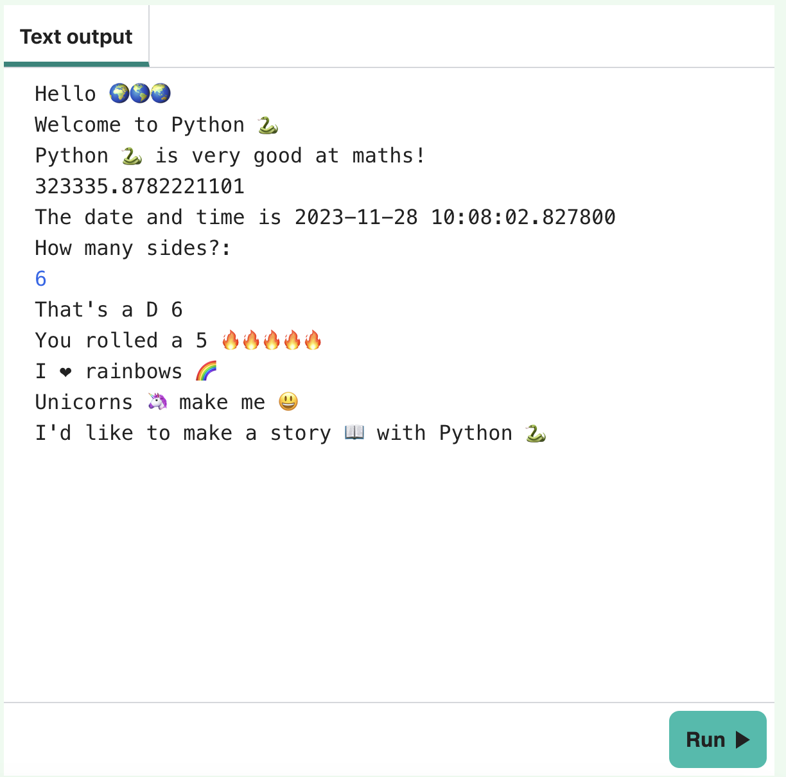

  <a class="c-survey-banner__link" href="https://form.raspberrypi.org/f/code-editor-feedback" target="_blank">Take our survey</a> to help make our Code Editor better!

## You will make

Find out how to display text and numbers in Python. Write a simple program that uses emojis. 🙌 🙌🏼 🙌🏽 🙌🏾 🙌🏿

**Emoji** means 'picture word' in Japanese. Emojis are small colourful images. 🥰

--- no-print ---

### Play ▶️

--- task ---

  

Click the **Run** button and read the output.

Type in a number and press <kbd>Enter</kbd>. 

How is your answer used?

<iframe src="https://editor.raspberrypi.org/en/embed/viewer/hello-world-solution" width="600" height="600" frameborder="0" marginwidth="0" marginheight="0" allowfullscreen>
</iframe>

--- /task ---

--- /no-print ---

--- print-only ---

{:width="640px"}

--- /print-only ---
