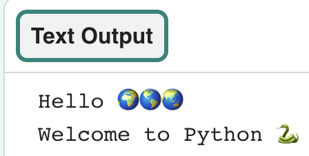
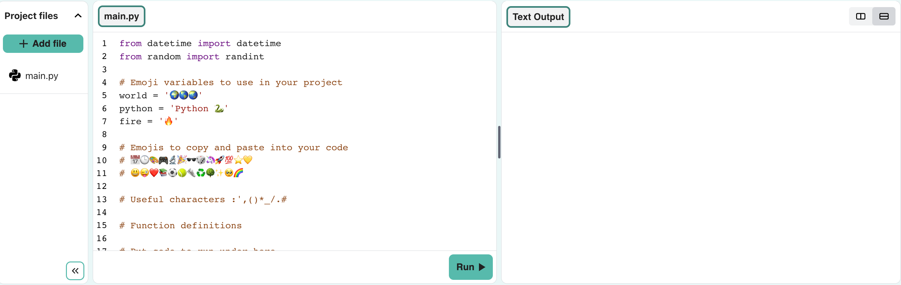
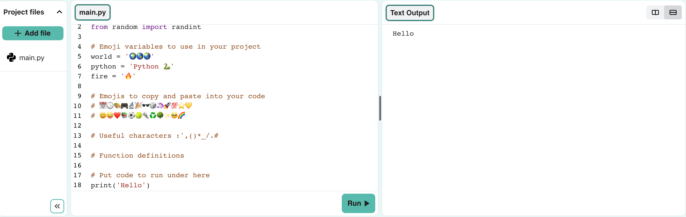
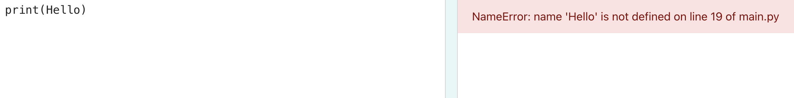

## Say hello

{:width="200px"}

--- task ---

Open the [Hello 🌍🌎🌏 starter project](https://staging-editor.raspberrypi.org/en/projects/hello-world-starter-simple){:target="_blank"}. The Code Editor will open in another browser tab.

If you have a Raspberry Pi account, click the **Save** button to save a copy to your **Projects**.

--- /task ---

### Print Hello

In Python, `print()` outputs text (words or numbers) to the screen.

--- task ---

Find the line `# Put code to run under here`.

The flashing `|` is the cursor. It shows where you will type.

--- /task ---

--- task ---

Type the code to `print()` Hello to the screen:

--- code ---
---
language: python
line_numbers: true
line_number_start: 18
line_highlights: 19
---

# Put code to run under here
print('Hello')

--- /code ---

--- /task ---

--- collapse ---
---
title: Tip for using print
---

When you type an opening bracket `(`, the Code Editor will automatically add a closing bracket `)`. This also happens when you type an opening quote `'`.

--- /collapse ---

--- collapse ---
---
title: How to type special characters on a UK or US keyboard
---

On a UK or US keyboard, the left `(` and right `)` round brackets are on the <kbd>9</kbd> and <kbd>0</kbd> keys. To type a left round bracket, hold down the <kbd>Shift</kbd> key (next to <kbd>Z</kbd>) and press <kbd>9</kbd>.

The single quote `'` is on the same row as the <kbd>L</kbd> key.

The comma `,` is next to the <kbd>M</kbd> key.

--- /collapse ---

--- task ---

**Test:** Click the **Run** button. Your code will output in the Text Output area.

--- /task ---

--- collapse ---

---
title: Debug
---

If you get an error, check your code really carefully. Check there are single quotes around `Hello` so Python knows it is meant to be text.

--- /collapse ---

