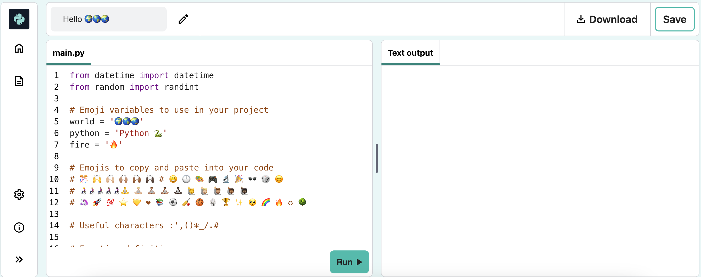

## Say hello

<div style="display: flex; flex-wrap: wrap">
<div style="flex-basis: 200px; flex-grow: 1; margin-right: 15px;">
It's traditional to write a program to output 'Hello world!' when you learn a new programming language.
</div>
<div>

{:width="200px"}

</div>
</div>

--- task ---

Open the [Hello 🌍🌎🌏 starter project](https://editor.raspberrypi.org/en/projects/hello-world-starter){:target="_blank"}. The code editor will open in another browser tab.



If you have a Raspberry Pi account, you can click on the **Save** button to save a copy to your **Projects**.

--- /task ---

--- collapse ---

---
title: Working on a Raspberry Pi?
---

If you're working on a Raspberry Pi using Chromium, you may not see the emojis. You need to install a font that supports them.

Open a terminal and then type:

```bash
sudo apt install fonts-noto-color-emoji
```

Restart Chromium and you should see the colour emojis.

--- /collapse ---

### Print hello

<p style="border-left: solid; border-width:10px; border-color: #0faeb0; background-color: aliceblue; padding: 10px;">
Lines beginning with a `#` are <span style="color: #0faeb0">**comments**</span>. They explain what the code will do. Comments are ignored by Python.
</p>

The `import` lines at the start of the code tell Python that you are going to use code you didn't write.

In Python, `print()` outputs text (words or numbers) to the screen.

--- task ---

Find the `# Put code to run below here` line.

Click below that line. The flashing `|` is the cursor and shows where you will type.

--- /task ---

--- task ---

Type the code to `print()` Hello to the screen:

**Tip:** When you type an opening bracket `(` or opening apostrophe `'` the code editor will automatically add a closing bracket `)` or closing apostrophe`'`:

--- code ---
---
language: python
filename: main.py
line_numbers: true
line_number_start: 17
line_highlights: 18
---

# Put code to run under here    
print('Hello')

--- /code ---

--- collapse ---
---
title: Typing special characters on a UK or US keyboard
---

On a UK or US keyboard, the left `(` and right `)` round brackets are on the <kbd>9</kbd> and <kbd>0</kbd> keys. To type a left round bracket, hold down the <kbd>Shift</kbd> key (next to <kbd>Z</kbd>) and then tap <kbd>9</kbd>.
The single quote `'` is on the same row as the <kbd>L</kbd> key, just before the <kbd>Enter</kbd> key.
The comma `,` is next to the <kbd>M</kbd>.

--- /collapse ---

--- /task ---

--- task ---

**Test:** Click on the **Run** button to run your code. In the code editor, the output will appear on the right:

 

**Debug:** If you get an error then check your code really carefully. In this example, the single quotes around `Hello` are missing so Python doesn't know it is supposed to be text.

 

--- /task ---

## Print 🌍🌎🌏

In Python, a **variable** is used to store values such as text or numbers. Variables make it easier for humans to read code. You can use the same variable in lots of places in your code. Choosing a sensible name for a variable makes it easier for you to remember what it is for.

We have included some variables that store emoji characters.

--- task ---

In your code editor, scroll to the lines with the emojis stored into two different variables. Find the variable `world`, which stores the text '🌍🌍🌍'.

--- /task --- 

--- task ---

You can `print()` more than one item at a time by including a comma `,` in between the items. `print()` will add a space between each item.
 
Change your code to also `print()` the contents of the `world` variable:

--- code ---
---
language: python
filename: main.py
line_numbers: true
line_number_start: 17
line_highlights: 18
---

# Put code to run under here    
print('Hello', world) 

--- /code ---

**Tip:** `'Hello'` is a text string because it has single quotes around it, whereas `world` is a variable so the value stored in it will be printed. 

--- /task ---

--- task ---

**Test:** Run your code to see the result:


**Tip:** Emojis can look different on different computers, so yours might not look exactly the same.

**Debug:** Make sure that you have added a comma between the items in `print()` and that you have spelled `world` correctly.

This example is missing the comma `,`. It's small but very important!

 

--- /task ---

--- task ---

**Add** another line to your code to `print()` more text and emojis:

--- code ---
---
language: python
filename: main.py
line_numbers: true
line_number_start: 18
line_highlights: 19
---

print('Hello', world)    
print('Welcome to', python) 

--- /code ---

**Tip:** The code you need to type is highlighted in a lighter colour. Code that is not highlighted helps you find where you need to add the new code.

--- /task ---

--- task ---

**Test:** Click **Run**. 


**Tip:** It's a good idea to run your code after every change so you can fix problems quickly.

**Debug:** Check carefully for brackets, quotes, commas, and correct spelling. Python needs you to be really accurate.

--- /task ---

If you have a Raspberry Pi account, on your code editor you can click on the **Save** button to save a copy of your project to your Projects.

--- save ---
