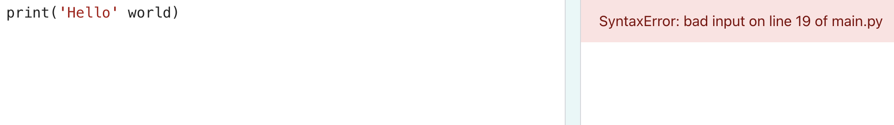

## Print variables

A **variable** is used to store values such as text or numbers. Choosing a sensible name for a variable makes it easier for you to remember what it is for.

We have included some variables that store emoji characters.

--- task ---

In your code editor, scroll to the lines with the  variable `world`, which stores the text '🌍🌍🌍'.

--- /task --- 

--- task ---
 
Change your code to also `print()` the contents of the `world` variable:

--- code ---
---
language: python
filename: main.py
line_numbers: true
line_number_start: 17
line_highlights: 18
---

# Put code to run under here    
print('Hello', world) 

--- /code ---

--- /task ---

--- collapse ---

---
title: Tip for using print()
---

`'Hello'` is a text string because it has single quotes around it, whereas `world` is a variable so the value stored in it will be printed. 

--- /collapse ---

--- task ---

**Test:** Run your code to see the result:

--- /task ---

--- collapse ---

---
title: Did the editor show an error
---
Make sure that you have added a comma between the items in `print()` and that you have spelled `world` correctly.

This example is missing the comma `,`. It's small but very important!

 

--- /collapse ---

--- task ---

**Add** another line to your code to `print()` more text and emojis:

--- code ---
---
language: python
filename: main.py
line_numbers: true
line_number_start: 18
line_highlights: 19
---

print('Hello', world)    
print('Welcome to', python) 

--- /code ---

--- /task ---

--- task ---

Make sure you check carefully for brackets, quotes, commas, and correct spelling.

**Test:** Click **Run**. 

--- /task ---

--- collapse ---
---
title: Tip for writing programs
---

It's a good idea to run your code after every change so you can fix problems quickly.

--- /collapse ---

If you have a Raspberry Pi account, on your code editor you can click on the **Save** button to save a copy of your project to your Projects.

--- save ---
