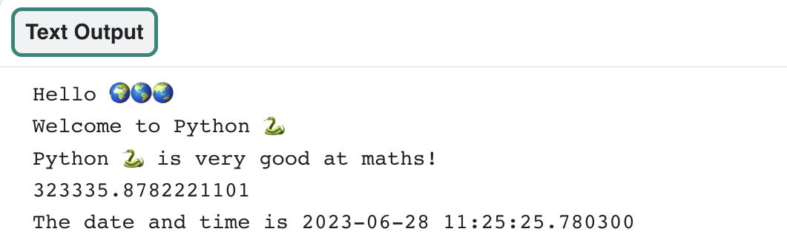

## Do sums

{:width="300px"} 

In Python, you can work with numbers and dates. You can use arithmetic operators to do sums:

| + | add |   
| - | subtract |   
| * | multiply |   
| / | divide |   
| ** | to the power |   

### Create a calculation

--- task ---

Add two more `print()` lines to your code including a sum for Python to do:

**Tip:** To get an `*` symbol, press the <kbd>Shift</kbd> and <kbd>8</kbd> keys at the same time.

--- code ---
---
language: python
line_numbers: true
line_number_start: 19
line_highlights: 21-22
---

print('Hello', world)
print('Welcome to', python)
print(python, 'is very good at maths!')
print(230 * 5782 ** 2 / 23781)  # Print the result of the sum

--- /code ---

--- /task ---

--- collapse ---

---
title: Comments
---

Sentences beginning with `#` are **comments**. You do not need to type the comments — they are just there to help you understand the code.

--- /collapse ---

--- task ---

**Test:** Run your code. Python will do the sum and ouput the result.

**Debug:**

--- collapse ---
---
title: I have a syntax error
---

Make sure you have added a comma `,` between the items in `print()` and you have spelled `python` correctly.

--- /collapse ---

--- /task ---

