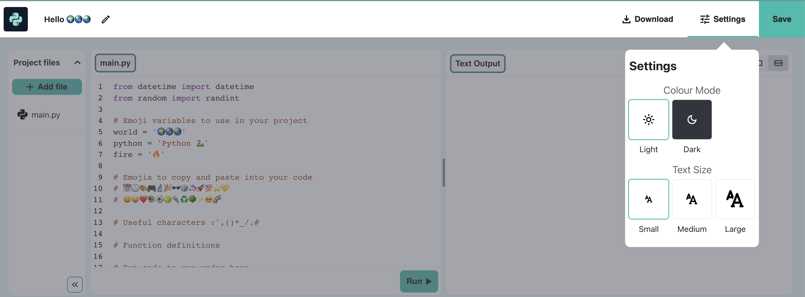

## Calculating sums

{:width="300px"} 

In Python you can work with numbers and dates. You can use maths operators to do sums:

| + | add |   
| - | subtract |   
| * | multiply |   
| / | divide |   
| ** | to the power |   

### Create a calculation

--- task ---

Add another two `print()` lines to your code including a sum for Python to calculate:

**Tip:** To get a `*` symbol press <kbd>Shift</kbd> and <kbd>8</kbd> at the same time.

--- code ---
---
language: python
filename: main.py
line_numbers: true
line_number_start: 18
line_highlights: 20-21
---

print('Hello', world)   
print('Welcome to', python)   
print(python, 'is very good at maths!')   
print(230 * 5782 ** 2 / 23781)  # Print the result of the sum

--- /code ---

--- /task ---

--- collapse ---

---
title: Tip on using comments
---

Lines beginning with a `#` are **comments**. You don't need to type the comments, they are just there to help you understand the code. Just type the code before the `#`.

--- /collapse ---

--- task ---

**Test:** Run your code. You should see the sums calculated and output.

**Debug:**

--- collapse ---
---
title: I have a syntax error
---

Make sure that you have added a comma `,` between the items in `print()` and that you have spelled `python` correctly.

--- /collapse ---

--- /task ---

--- task ---

Try changing the sum that Python does to a complicated one!

You can also use brackets if you want to control the order that Python calculates the sum: `print( (2 + 4) * (5 + 3) )`.

--- /task ---

--- task ---

**Test:** Run your code and get Python to calculate your sum.

**Debug:** Make sure your sum has a left and right round bracket around it `( 2 * 45 )`. If you use extra brackets to control the order, make sure you have a right bracket to match every left bracket.

--- /task ---

The line `from datetime import *` at the top of the **main.py** tab includes a library with helpful functions for getting the current date and time.

--- task ---

Add another line to your code to `print` the current date and time.

Get the current date and time by using the `now()` function from the `datetime` library:

--- code ---
---
language: python
filename: main.py
line_numbers: true
line_number_start: 20
line_highlights: 22
---

print(python, 'is very good at maths!')    
print(230 * 5782 ** 2 / 23781)  # Print the result of the sum     
print('The date and time is', datetime.now())  # Print the current date and time
 
--- /code ---

--- /task ---

--- collapse ---

---
title: Changing text size on the editor
---

On the code editor, you might find the text too big or too small to read. You can easily change these settings to suit your preference. 

**Tip:** Click on the **Settings menu** (the icon next to the Save button) in the top-right of your code editor. Then click on any of the **Text Size** buttons to change the size of the text. 

You can also switch between colour modes, click on the **Light & Dark** buttons to see the changes.

--- /collapse ---

--- task ---

**Test:** Run your code a couple of times to see the time update.

**Debug:** Check that you have a fullstop `.` between `datetime` and `now`. Check all the punctuation carefully.

--- /task ---

--- save ---
