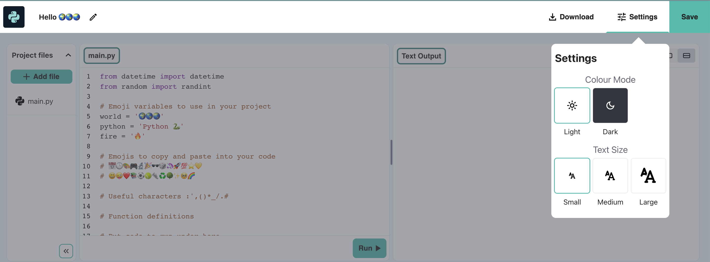

## Using date and time

The line `from datetime import *` at the top of the **main.py** tab includes a library with helpful functions for getting the current date and time.

--- task ---

Add another line to your code to `print` the current date and time.

Get the current date and time by using the `now()` function from the `datetime` library:

--- code ---
---
language: python
filename: main.py
line_numbers: true
line_number_start: 20
line_highlights: 22
---

print(python, 'is very good at maths!')    
print(230 * 5782 ** 2 / 23781)  # Print the result of the sum     
print('The date and time is', datetime.now())  # Print the current date and time
 
--- /code ---

--- /task ---

--- collapse ---

---
title: Changing text size on the editor
---

On the code editor, you might find the text too big or too small to read. You can easily change these settings to suit your preference. 

**Tip:** Click on the **Settings menu** (the icon next to the Save button) in the top-right of your code editor. Then click on any of the **Text Size** buttons to change the size of the text. 

You can also switch between colour modes, click on the **Light & Dark** buttons to see the changes.

--- /collapse ---

--- task ---

**Test:** Run your code a couple of times to see the time update.

**Debug:** Check that you have a fullstop `.` between `datetime` and `now`. Check all the punctuation carefully.

--- /task ---

--- save ---
