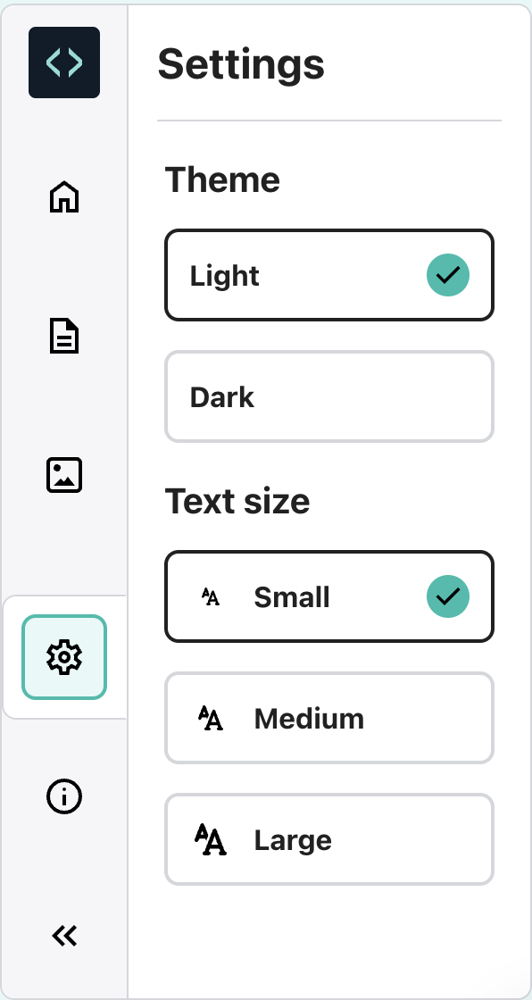

## Use date and time

The line of code `from datetime import` includes a library with helpful functions to get the current date and time.

--- task ---

Add another line to your code to `print()` the current date and time.

To get the current date and time, use the `now()` function from the `datetime` library:

--- code ---
---
language: python
line_numbers: true
line_number_start: 21
line_highlights: 23
---

print(python, 'is very good at maths!')
print(230 * 5782 ** 2 / 23781)  # Print the result of the sum
print('The date and time is', datetime.now())  # Print the current date and time
 
--- /code ---

--- /task ---

--- collapse ---

---
title: How to change text size in the Code Editor
---

In the Code Editor, you might find the text too big or too small to read. You can easily change these settings.

Click on the **Settings** icon on the left-hand side of the Code Editor (next to the **Images** icon). Then, click any of the **Text size** buttons to change the size of the text.

You can also switch between themes. Click the **Light** and **Dark** buttons to see the changes.

--- /collapse ---

--- task ---

**Test:** Run your code two or three times to see the time update.

**Debug:** Check that you have a full stop `.` between `datetime` and `now()`. Check all the punctuation carefully.

--- /task ---

--- save ---
