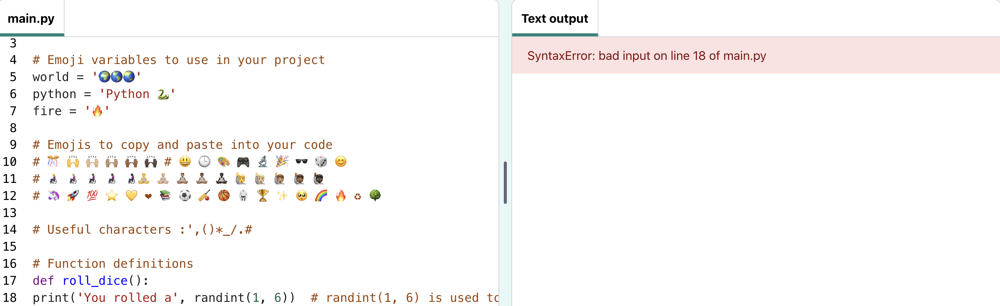

## Roll a dice 🎲

In Python, you **call** a **function()** to perfom an action. You have already used the `print()` function to output text.

{:width="300px"}

### Define your function

--- task ---

Functions need to be defined before you can call them. Look for the comment in the **main.py** file that says `# Function definitions`.

Define a new function called `roll_dice()` that uses the `randint()` function (from the `random` library).  

Your function needs to generate a random 'integer' (whole number) from 1 to 6 and output it to the screen.

--- code ---
---
language: python
line_numbers: true
line_number_start: 16
line_highlights: 17-18
---

# Function definitions
def roll_dice():  # Don't forget the colon at the end of this line   
    print('You rolled a', randint(1, 6))  # randint(1, 6) is used to give a number between 1 and 6

--- /code ---

--- /task ---

--- collapse ---

---
title: Tips for using functions
---

The line under `def roll_dice():` is **indented**. To indent code, use the <kbd>Tab</kbd> key on your keyboard (usually above <kbd>Caps Lock</kbd> on the keyboard). Indenting code tells Python that the indented lines are part of the function.

In Python:
  - **functions**, defined with `def`, are like 'My Blocks' in Scratch
  - `randint` is like 'random' in Scratch
  - `input` is like 'ask' in Scratch

**Tip:** The underscore `_` is used between words in variable and function names in Python to make them easier to read. You cannot use a space.

--- /collapse ---

--- task ---

**Test:** If you **Run** your code now, it will not roll a dice. That is because you have defined the `roll_dice()` function, but not called it yet.

**Debug:** 

--- collapse ---
---
title: I have a syntax error 
---

- Make sure you have an underscore `_` between `roll` and `dice()` to make the function name.

- Make sure you have a colon `:` at the end of the line.

- Check that the line under `def roll_dice():` is indented. It is really common to get this wrong in Python, so make sure to check.

--- /collapse ---

--- /task ---

### Call your function

--- task ---

To use a function, you need to **call** it in the code. Go to the end of your code and add a new line to call the `roll_dice()` function:

--- code ---
---
language: python
line_numbers: true
line_number_start: 25
line_highlights: 27
--- 

print('The date and time is', datetime.now())

roll_dice()  # Call the roll dice function

--- /code ---

--- /task ---

--- task ---

**Test:** Run your code several times to see the random dice roll each time. 

--- /task ---
